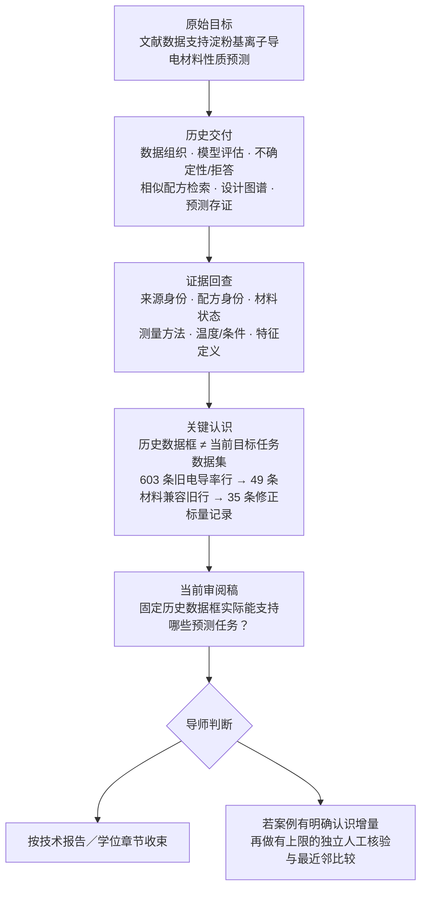

# 淀粉材料文献证据：数据适用性审计与导师审阅

本仓库是 `scdgel` 项目的**公开审阅快照**，用于集中展示研究脉络、当前中英文审阅稿、关键图件和有限的公开证据摘要。

项目最初希望利用文献数据支持淀粉基离子导电材料的性质预测，并形成了数据组织、模型评估、不确定性/拒答接口、相似配方检索、设计图谱和预测存证等历史成果。后续针对来源身份、材料状态、测量方法、温度和特征定义的回查发现，历史数据框中的相当一部分记录不能直接对应原先设定的水凝胶预测任务。

**当前定位：不再用同一批现有数据继续追加水凝胶预测模型；现有材料优先整理为数据适用性审计技术报告／学位论文章节候选。独立案例论文是否值得继续，由导师根据案例本身的认识增量判断。**

原定电导率／弹性模量 `R² > 0.85` 未实现；当前修正证据上没有重新拟合模型，独立人工核验尚未完成。本轮不新增模型、扩库、PG098 核查或湿实验。

## 研究如何走到这里

这张流程图只用于导航研究演化，不是新的定量分析。

## 导师当前需要判断什么

核心问题不是“下一步换哪个模型”，而是：

> **这个具体的数据适用性案例是否具有足够的认识增量，值得再投入一次预先限定范围的独立人工核验？**

若认识增量有限，则按技术报告／学位章节收束；若案例本身值得继续，则先完成范围固定的独立人工核验和最近邻工作比较，再判断是否保留独立案例论文的可能性。

## 当前初稿概括

当前稿题为 **A bounded audit of conductivity records and prediction tasks in starch materials**。核心问题是：当来源、配方身份、材料状态、测量方法、温度和特征定义被重新显式化以后，一个固定历史数据框实际还能支持哪些预测任务？

### 1. 从历史表格到可追溯证据

审计覆盖 **603 条旧电导率行**。按当前项目材料判据，49 条旧行与核心材料范围兼容；经直接保留、确认重复报告合并、不同条件拆分等记录重建后，形成 **35 条修正标量记录，对应 34 个不同配方概况和 15 个保守来源组**。

这三个数字属于不同计数层级，不能互换，也不能直接视作独立实验数。

### 2. 真正可用的数据量取决于具体任务

| 任务 / 证据视图 | 记录 | 概况 | 保守来源组 |
| --- | ---: | ---: | ---: |
| 全部修正水凝胶标量证据 | 35 | 34 | 15 |
| bulk，数值 20–30°C | 2 | 2 | 2 |
| bulk，恰好 25°C | 0 | 0 | 0 |
| bulk，仅文字室温 | 11 | 11 | 4 |

两条数值 20–30°C 记录都在 30°C，并分别来自一个单例来源组。当前登记的修正水凝胶任务中，没有一项达到 5 个来源组，因此原定五折 source-hold-out 无法按既定设计定义。这是**任务规模和评价设计的限制**，不是一个已经得到的低性能结果。

独立盘点的干膜历史证据更多：允许近似温度时，近室温 printed-point bulk 任务为 **35 个概况 / 11 个保守来源组**；排除近似温度后为 **26 / 10**。干膜属于另一材料总体，因此这里只把它作为候选研究对象。

### 3. 历史模型结果保留，但解释范围改变

历史模型、旧分组评估和冻结分数是真实的历史研究输出，但属于原输入、原目标和原协议。当前没有在 35 条修正记录上重新拟合模型，因此不能把历史 `R²`、AUC 或 macro-F1 改称“修正水凝胶任务性能”，也不能据此声称清洗后性能提高或下降。

既有模拟和外部聚合物电解质诊断只承担评价边界解释作用，不增加淀粉样本量；相关图保留在 Supplementary Information。

### 4. 当前可能形成的贡献

目前最可讨论的增量不是新算法，而是一个**有边界的数据适用性案例**：把“文献中有数值”“数值可追溯”“材料符合当前定义”“数值适合某个预测任务”分开，并把来源复用、材料状态、测量条件和评价解释连接到具体任务规模。

独立论文价值仍未确定。最重要的缺口是独立人工核验尚未完成，部分材料和来源身份仍未决，与最近邻工作的系统增量比较仍不足。

## 历史工作还保留什么价值

后续审计改变的是部分历史结果的**解释和适用范围**，不是把历史项目整体判为无效。

| 历史成果 | 当前如何理解 |
| --- | --- |
| 文献数据组织与可追溯结构 | 保留；是后续来源、材料和任务适用性审计的基础。 |
| 模型、分组评估与历史性能 | 保留为旧输入／旧协议下的真实结果；不作为当前修正水凝胶性能。 |
| 共形集合与拒答接口 | 保留为已完成的模型工程与不确定性/适用域实践。 |
| 相似配方检索与设计图谱 | 保留为数据组织和候选探索工具；不等于已验证实验推荐。 |
| 预测存证 | 保留为前瞻计划和工程留痕；目前没有真实实验返回。 |
| 后续来源／材料／测量审计 | 构成当前稿最主要的新内容，并负责重新限定历史成果可以支持的主张。 |

## 审阅文件

| 内容 | Markdown | Word | PDF |
| --- | --- | --- | --- |
| 英文正文 | [阅读](docs/deliverables/2026-09_applicability_audit/manuscript.md) | [下载](docs/deliverables/2026-09_applicability_audit/manuscript.docx) | [阅读](docs/deliverables/2026-09_applicability_audit/manuscript.pdf) |
| 完整中文对照稿 | [阅读](docs/deliverables/2026-09_applicability_audit/manuscript_cn.md) | [下载](docs/deliverables/2026-09_applicability_audit/manuscript_cn.docx) | [阅读](docs/deliverables/2026-09_applicability_audit/manuscript_cn.pdf) |
| Supplementary Information | [阅读](docs/deliverables/2026-09_applicability_audit/supplementary_information.md) | [下载](docs/deliverables/2026-09_applicability_audit/supplementary_information.docx) | [阅读](docs/deliverables/2026-09_applicability_audit/supplementary_information.pdf) |

- [审阅包说明](docs/deliverables/2026-09_applicability_audit/README.md)
- [公开范围与复现边界](docs/scope_and_reproducibility.md)
- [冻结计数摘要](data/review_summary.json)

## 公开范围

本仓库只保留导师审阅所需的公开材料。它**不包含**项目管理记录、内部协作日志、完整论文全文、原始论文 PDF/整页来源图、完整私有事实表与来源重建、私有清洗/来源映射、历史模型二进制、凭据或本机配置。

公开文档和机械一致性检查不把 AI 辅助判断转换成人工认证。需要来源级复核时，应按 DOI 自行取得原文并独立核验。
