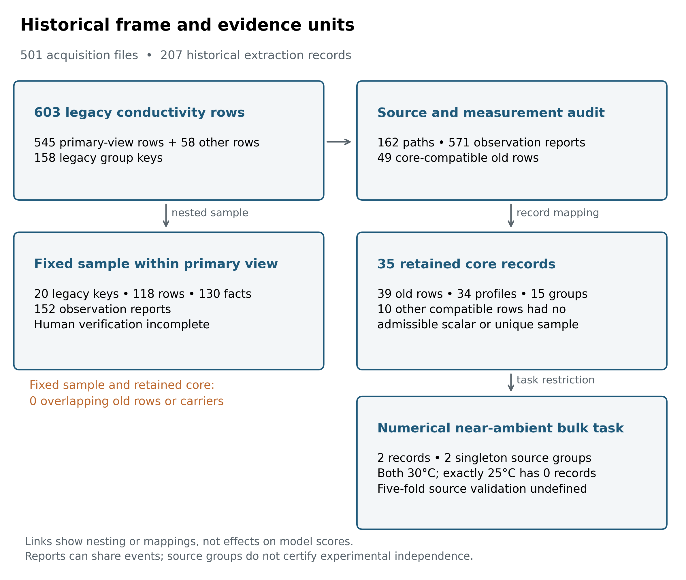
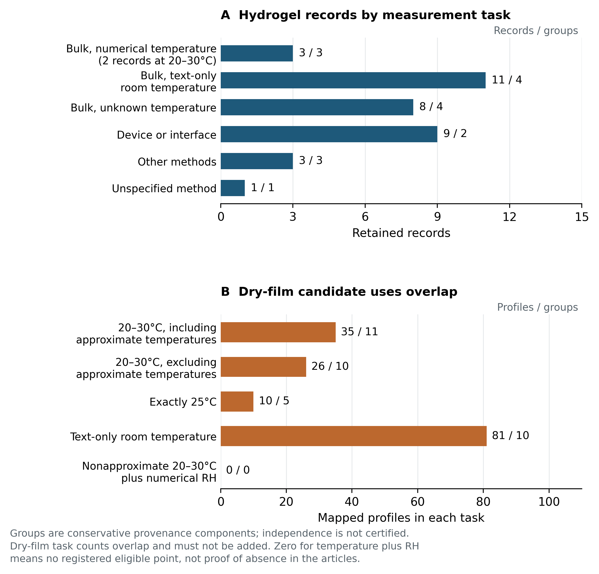

# A bounded audit of conductivity records and prediction tasks in starch materials

**Review draft, 18 September 2026.**

## Abstract

A traceable conductivity value need not support the prediction task for which it was assembled. We examined this distinction through a retrospective, AI-assisted audit of a fixed historical starch-material data frame. The audit covered 603 legacy conductivity rows and distinguished reporting carriers, known or candidate measurement origins, formulation profiles, condition-specific observations and task eligibility. Under the existing aqueous-hydrogel criteria, 49 legacy rows were material-compatible. After merging confirmed repeated reports and separating distinct conditions, 35 scalar evidence records representing 34 formulation profiles and 15 conservative source groups were retained. Only 2 records from 2 singleton groups met the task requiring an author-reported printed point value for bulk impedance conductivity at an explicitly numerical temperature of 20–30°C; both were at 30°C and neither was at exactly 25°C. Text-only room-temperature bulk reports formed a separate task with 11 profiles in 4 groups. A separate dry-film inventory contained 231 legacy rows and yielded 35 near-ambient profiles in 11 groups when approximate numerical temperatures were allowed, or 26 profiles in 10 groups when they were excluded. These inventories are evidence collections rather than training matrices. Existing simulations and an external diagnostic provide auxiliary evidence about evaluation interpretation; they neither enlarge nor validate the starch evidence. Independent human verification remains incomplete, and no corrected starch model was fitted. The findings document how measurement identity changes the uses supported by one historical property table; they do not establish a new general auditing method or a limit on hydrogel predictability.

Keywords: starch materials; ionic conductivity; literature data; measurement conditions; data applicability; grouped validation

## 1 Introduction

The practical question behind a literature-derived materials model is whether its records represent the material and measurement that a researcher intends to predict. A conductivity value can be transcribed correctly while referring to a dry film, a hydrated network, a different temperature, or an electrode-containing device. These alternatives are consequential when the intended use is to compare aqueous starch-hydrogel formulations. Combining them in a numerical target changes the scientific question even if every unit conversion is arithmetically correct.

Information reuse, dependence between records and validation aligned with intended use are established concerns in machine-learning-based science [1,2]. Critical examination of text-mined materials recipes also provides precedent for asking what scientific information such compilations can support [3]. Related materials-data work provides concrete examples of grouped splitting to prevent leakage [4], DOI-traceable conductivity curation and cross-source consistency checks [5], and article-level reinspection and correction of electrolyte data before model use [6]. These precedents motivate explicit source, condition and task definitions; they do not by themselves validate the starch classifications in the historical frame examined here.

The present case originated in an attempt to evaluate whether literature-derived composition and processing information could support conductivity prediction relevant to starch-based aqueous hydrogels. Its historical models were evaluated before a later source and measurement audit was complete. The audit exposed distinctions that a change of model alone cannot resolve: a reporting article is not necessarily the origin of every measurement it quotes; a sample label is not necessarily one measurement condition; and a record nominally labeled as a gel does not establish the state in which conductivity was measured.

We therefore ask a narrower question: within this fixed historical frame, which prediction uses remain supported after source identity, material eligibility, measurement conditions and feature definitions are made explicit? The empirical contribution under consideration is a traceable case connecting those distinctions to concrete task sizes and limits on interpretation. It is not a new splitting algorithm, shrinkage estimator or general data-cleaning method.

The main results reconstruct the relationship between historical rows and task-specific evidence, distinguishing the defined aqueous-hydrogel task from a separate dry-film inventory. Previously completed simulations and an external polymer-electrolyte diagnostic are summarized briefly as auxiliary evidence on evaluation interpretation, with their full results retained in the Supplementary Information. They do not verify the starch material classifications or increase the starch sample size.

## 2 Methods

### 2.1 Historical frame and retrospective design

The acquisition frame comprised 501 available full-text files: 155 legacy-source files and 346 files from fixed Web of Science retrievals. Historical screening retained 207 extraction records. This assembled frame was not a random sample of the field or an exhaustive systematic review. Acquisition files, extraction records, model rows and source identities were retained as different counting units.

The audited conductivity frame consisted of 603 legacy rows indexed by 158 legacy group keys. Its primary historical modeling view required at least two rows per legacy group and contained 545 rows, 100 keys and 104 ingestion paths. A fixed sample of 20 of those 100 keys had been selected without replacement using seed 20260908, retaining all 118 associated rows and their 130 conductivity facts. AI-assisted source and measurement review of that sample was followed by a broader inventory of all 603 conductivity rows. The latter covered 162 ingestion paths and registered 571 observation reports; additional searches for cited measurement origins were recorded separately. Reports are not necessarily independent experiments, and some legacy rows had conditions but no admissible scalar observation.

The audit and correction protocol were developed after earlier results and source problems had been examined. The correction rules were recorded and committed before the corrected evidence table was generated, but this ordering does not make the study prospectively blinded. Similarly, the dry-film questions were specified before their cross-tabulation, after the hydrogel inventory was known. This manuscript reorganizes those completed records and frozen analyses. It reports no new fitting, parameter search, permutation execution, simulation or expansion of the literature frame.

### 2.2 Sources, profiles and measurement reports

We distinguished the ingested file, its actual reporting article, the known or candidate origin of a measurement, the recorded formulation profile, and the observation under stated conditions. Source identity was assessed using available article headers, DOI and title information, indexed passages and targeted original-page checks. A matching DOI or title was not treated as proof that experimental measurements were independent. Confirmed repeated reports were linked separately from possible reuse. Conservative source groups connected known and flagged possible relations without asserting that every possible relation was established.

Observation records retained the original sample label, printed value and unit, temperature, measurement method, state or conditioning information, source location and unresolved issues. Text, author tables, graph-derived information, approximate numbers, orders of magnitude and internally conflicting reports were distinguished. Multiple descriptions of the same event could produce several reports, while one historical row could combine multiple conditions. Accordingly, neither observation-report counts nor old-row counts were interpreted as independent sample sizes.

`Author-reported printed point value` denotes a scalar value explicitly displayed by the authors in a form admissible under the frozen protocol. It is a reporting-form label, not a claim of physical exactness or independent accuracy. Approximate values, graph-derived values, ranges, orders of magnitude and unresolved conflicting reports remain separate evidence classes.

The historical modeling target had been the median of eligible linear conductivity values in S/cm within an ingested sample key, followed by log10 transformation. This is a description of the previous computation, not an endorsement of aggregation across temperatures or methods. The corrected evidence protocol instead retained condition-specific scalar reports and explicit links to the old rows. A full disposition ledger recorded exclusions, unresolved cases, merges, splits and feature corrections, including rows that produced no retained record.

### 2.3 Material eligibility and measurement tasks

The aqueous-hydrogel target retained the existing material criteria. Starch had to be the principal network polymer, nominally approximately 50% or more of network-forming polymer mass, with water-dominated gel state at the conductivity measurement and predominantly ionic conduction. The network denominator excluded water, salts, liquid plasticizers and fillers but included polymerized synthetic comonomers. Co-network systems and other solvent families were retained as noncore evidence rather than pooled with the target. Dry films, solutions and pellets did not meet the gel-state requirement. These are scope definitions for this project, not a universal taxonomy of conductive materials.

Preparation with water, gelatinization during synthesis or drying for a separate microscopy experiment did not alone establish the state during conductivity measurement. Ambiguous material identity, phase or composition remained unresolved. Unknown residual water was not assigned zero, and a preparation water quantity was not substituted for water content at measurement.

The principal numerical near-ambient task required a material-compatible record, an author-reported printed point value, bulk conductivity from impedance resistance and geometry, and an explicitly numerical measurement temperature within 20–30°C. For a profile with multiple eligible points, the protocol selected the point nearest 25°C and the lower temperature for an equal-distance tie. This is a near-ambient task, not an isothermal 25°C task. Exactly 25°C was examined separately. Author statements of room temperature without a number, unknown temperature, complete-device impedance, other methods and unspecified methods were separate uses.

Confirmed duplicate reports were merged only when sample, condition and method agreed. Different temperature or treatment states were retained separately. Unresolved conflicts were not averaged or resolved from a model prediction. Values were converted to S/cm using their stated units, preserving the reported precision. Graph-only reports and ranges were not converted into new scalar targets. The evidence table retained incomplete features with their original units, denominators and stage of measurement. It did not copy the old feature matrix wholesale or fill missing quantities to create an apparently complete design matrix.

Group size was based on distinct formulation profiles, not repeated temperatures or duplicate ingestion. The existing five-fold source-hold-out design requires at least five groups to be defined. The project's additional rule flagging fewer than 100 records together with fewer than 25 groups was retained as a descriptive-use restriction. It is an operational rule of these analyses, not a general theorem about the sample size required for materials learning.

### 2.4 Separate inventory of dry-film candidates

The dry-film inventory began with legacy rows that failed the gel-state criterion while passing the other recorded gates and the starch-matrix criterion. Existing sample-specific evidence distinguished films from pellets and solutions. The inventory then assessed all 19 specified measurement uses, including empty results. It separated printed points from approximate values and graphs; bulk impedance from spectral or fitted estimates; numerical temperature from text-only room temperature; and measured humidity from preconditioning.

Counts were computed after confirmed report deduplication, using conservative source groups and retaining uncertain profile mappings. Sensitivities removed approximate numerical temperatures, restricted the temperature to exactly 25°C, or excluded groups with registered unresolved measurement lineage. The latter restriction did not certify the remaining groups as independent. This was a feasibility inventory of existing evidence, without selecting a new conductivity target column or constructing a dry-film training set.

### 2.5 Retained simulation and external diagnostic analysis

The retained evaluation diagnostic compared a feature model with a source reference estimated from training responses only. Its paired statistic was

$$
\Delta_{\mathrm{shrunk}} = R^2_{\mathrm{random}} - R^2_{\mathrm{shrunken\ reference}}.
$$

This statistic is distinct from source-held-out performance and from a within-source permutation test. Complete reference construction, group-bootstrap intervals, permutation procedures, simulation mechanisms and external-task filtering remain in the Supplementary Information. No new simulation, permutation or external fit was executed for this review draft.

## 3 Results

### 3.1 The historical modeling frame was not the target material population

The material inventory classified the 603 legacy rows as 49 core-compatible, 57 noncore, 379 outside the defined scope and 118 unresolved. Within the historical 545-row primary view, the corresponding counts were 43, 39, 364 and 99 (Table 1). These are classifications under the current evidence and fixed criteria, not counts of erroneous papers. Outside-scope rows can describe valid measurements for another scientific question, while unresolved rows are not evidence of material ineligibility.

**Table 1. Counting units and material eligibility in the historical conductivity frame.** All classifications are AI-assisted. The fixed 118-row sample is nested in the 545-row view; the remaining 58 conductivity rows lie outside that view. Rows of this table must not be added indiscriminately.

| Frame | Legacy rows | Legacy group keys | Core-compatible | Noncore | Outside scope | Unresolved |
| --- | ---: | ---: | ---: | ---: | ---: | ---: |
| All audited conductivity rows | 603 | 158 | 49 | 57 | 379 | 118 |
| Historical primary view | 545 | 100 | 43 | 39 | 364 | 99 |
| Fixed sample within the primary view | 118 | 20 | 0 | 1 | 102 | 15 |
| Conductivity rows outside the primary view | 58 | 58 | 6 | 18 | 15 | 19 |

The source inventory distinguished 154 reporting-carrier identifiers. Known reuse links produced 151 confirmed source components, or 148 under conservative grouping of possible reuse. These components are bookkeeping units for provenance, not certified independent articles or experiments. Two confirmed same-article pairs and a shared-prior-measurement relation crossed legacy groups and folds in the historical primary view. Those particular cross-fold findings do not automatically apply to every historical subset: the stricter subset contained only one side of each same-article pair and neither of the two cited shared-measurement rows.

The original 118-row sample yielded 152 observation reports, with 14 supplementary follow-up items kept outside its sampling denominator. It contributed no record to the corrected core table. Its planned human audit therefore cannot automatically validate the corrected core population, even if eventually completed. Figure 1 summarizes these relationships without treating the reduction in counts as an effect on predictive performance.

**Figure 1. Historical rows, audit coverage and retained evidence.** Connections show nesting and record mappings, not causal effects of cleaning. The 571 observations are reports, including repeated descriptions and condition-specific observations, rather than independent experiments. The 35 core records link to 39 legacy rows; the other 10 material-compatible legacy rows did not yield an admissible scalar or unique sample. The original sampled rows and the corrected core records have no legacy-row or reporting-carrier overlap. Source groups and reporting components do not certify independence.

### 3.2 Problems arose at different levels

The record trail distinguishes limitations of the original report from mistakes introduced by processing, mismatch with a chosen task and overinterpretation of evaluation (Table 2). These categories can coexist in one record; the audit did not estimate their independent causal contributions to a model score.

An article can legitimately report several material forms or measurement estimates. For example, the potato-starch electrolyte study distinguished pellets from soft thick films, while its final-formulation value also had a conflict between reporting locations [10]. A different corn-starch study supplied temperature-dependent values that were aggregated in the historical table [11]. Another explicitly distinguished conductivity estimates obtained through different procedures [12]. Preserving these distinctions does not require claiming that the authors' experiments were wrong. It requires matching each report to the intended target, and retaining unresolved reporting conflicts as such.

**Table 2. Examples of distinct limitations and their consequences.** The Supplementary Information provides source locations and stable evidence identifiers. No example is an estimate of a field-wide error rate.

| Level | Registered example | Consequence for use |
| --- | --- | --- |
| Original reporting | Different values or sample assignments at separate locations in a source [10] | Hold the affected point when the report cannot resolve it; do not select whichever value fits expectations |
| Data processing | Aggregation across temperatures [11]; graph transcriptions treated as author tables; physical quantities assigned to the wrong feature names | Correct the representation or limit its use; these are not automatically errors in the source paper |
| Task definition | Pellets, films and gels pooled by a nominal label; different conductivity estimates treated as one target [10,12] | Define material state and observable before counting usable profiles |
| Evaluation interpretation | A source-reference difference or a permutation p-value interpreted as a mechanism or independent-source prediction | Report the distinct estimand and assumptions; neither establishes material eligibility |

The feature audit also identified twelve legacy facts in which activation energy or ionic transference number had been labeled as gel point or water activity. Those fields were not among the 21 inputs listed for the historical model, so their correction alone does not demonstrate a change in its reported process increment. More generally, salt fraction relative to a polymer, concentration of an immersion bath and final retained salt are not interchangeable inputs. The same applies to preparation water, solution volume, uptake and water fraction during conductivity measurement.

### 3.3 The corrected hydrogel evidence supported few same-task measurements

The 35 retained scalar records map to 34 distinct formulation profiles within 15 conservative source groups and link to 39 legacy rows. Five pairs of repeated reports were merged; one legacy row was separated into room-temperature and cold-treatment records. Thirty retained records connect to the historical primary view and five to rows outside it. The table is consequently neither a simple subset of 545 rows nor a complete prediction matrix.

**Table 3. Frozen corrected-hydrogel measurement categories and derived task views.** Mutual exclusivity applies to retained records in the six measurement-category rows. Formulation profiles and conservative source groups can recur across categories, so their row counts are not additive. The derived task rows are subsets or fixed sensitivities and must not be added to the category totals.

| Row type | Measurement category or derived task | Records | Profiles | Conservative source groups |
| --- | --- | ---: | ---: | ---: |
| Mutually exclusive category | Bulk, explicit numerical temperature | 3 | 3 | 3 |
| Mutually exclusive category | Bulk, text-only room temperature | 11 | 11 | 4 |
| Mutually exclusive category | Bulk, missing or ambiguous temperature | 8 | 8 | 4 |
| Mutually exclusive category | Complete device or interface estimate | 9 | 9 | 2 |
| Mutually exclusive category | Other measurement methods | 3 | 3 | 3 |
| Mutually exclusive category | Method unspecified | 1 | 1 | 1 |
| Derived task — subset of numerical-temperature bulk | Numerical 20–30°C | 2 | 2 | 2 |
| Derived task — subset of numerical-temperature bulk | Exactly 25°C | 0 | 0 | 0 |
| Derived task — group-size view | Numerical 20–30°C and ≥2 profiles per group | 0 | 0 | 0 |
| Derived task — group-size view | Text-only room temperature and ≥2 profiles per group | 9 | 9 | 2 |
| Derived task — frozen sensitivity | Numerical 20–30°C without the nominal composition-boundary case | 1 | 1 | 1 |
| Derived task — frozen sensitivity | Numerical 20–30°C without the ancillary-discrepancy case | 1 | 1 | 1 |

The six measurement-category rows are mutually exclusive at the record level and sum to 35 records. They do not sum to 35 distinct profiles or independent source groups: globally, the 35 records map to 34 distinct formulation profiles within 15 conservative source groups. The derived rows are nested task views of those same records.

Only 2 of the 3 numerical-temperature bulk records met the 20–30°C task. Both were measured at 30°C: sample CS:A 3:3 Sw had a printed value of 0.027 S/cm [8], and SHEM had 0.349 S/cm [9]. Each came from a singleton source group. There was no exactly 25°C record and no near-ambient source group containing two distinct profiles.

The first of these two records was at the nominal approximately 50% network-composition boundary. Its sample-specific table was retained under the protocol, while a generic battery-comparison value without matching sample and temperature remained an ancillary discrepancy. Removing either the boundary case or the record with that discrepancy left one near-ambient record. This sensitivity describes how the count depends on declared rules; it does not resolve the discrepancy or identify an optimal rule from model performance.

The text-only room-temperature bulk subset contained 11 profiles in 4 groups; requiring at least two profiles per group left 9 in 2 groups. No listed corrected-hydrogel task contained five source groups; the intended five-fold source-hold-out evaluation was therefore undefined under the recorded design. In addition, none of the 35 retained records had a certified numerical wet-basis water fraction bound to its conductivity measurement. This concerns the current record binding, not absence of every water measurement from the underlying articles.

Figure 2 places these categories alongside the separately inventoried dry-film uses.

**Figure 2. Task-specific availability under the recorded protocols.** A: the six disjoint method and temperature categories sum to 35 retained hydrogel records; only 2 of the 3 numerical-temperature bulk records are within 20–30°C. Labels give records and conservative source groups. B: selected dry-film uses show profile and conservative-group counts. Those uses overlap, and the numerical near-ambient count includes explicitly marked approximate temperatures unless the row excludes them. The zero for temperature plus humidity concerns registered point observations. None of the displayed counts is a released training population or a count of certified independent experiments; all task definitions and counts appear in the Supplementary Information.

### 3.4 More dry-film rows did not produce a ready alternative training population

The initial nongel gate envelope contained 234 legacy rows. Sample-specific evidence identified 2 pellets and 1 solution, leaving 231 dry-film rows from 45 reporting carriers. Confirmed report links reduced these to 220 report components, of which 212 could be mapped to profiles and 8 remained unresolved. Forty-four legacy rows lacked registered scalar observations; after confirmed deduplication, 38 report components had no observations, including 30 with identifiable profiles. Dry-film status did not imply zero residual water.

Among existing printed-point bulk reports, the numerical 20–30°C task contained 35 profiles in 11 conservative groups, including 9 profiles from one approximately 25°C source. Removing approximate temperatures left 26 profiles in 10 groups. Exactly 25°C supplied 10 profiles in 5 groups; excluding groups with registered unresolved lineage reduced this to 8 profiles in 4 groups. The text-only room-temperature task contained 81 profiles in 10 groups, with 53 profiles concentrated in two groups. Excluding registered unresolved lineage left 28 in 8 groups. These overlapping task counts cannot be added.

No registered printed-point observation met the combined requirement of nonapproximate numerical near-ambient temperature and numerical relative humidity at measurement. This zero is bounded by the existing observation table: four legacy rows from one source had recorded 25°C and 35% RH conditions but no registered scalar observation, so they were not counted as usable labels. It would be incorrect to turn this inventory gap into a claim that such measurements do not exist in the literature.

Feature support remained partial. In the 35-profile near-ambient dry-film task, 18 profiles had a known recorded recipe denominator and 17 only a partial denominator; none had a water-content value bound to the conductivity measurement. All candidate tasks triggered the existing descriptive-use size rule. The larger dry-film inventory therefore describes a different candidate population; it does not make the historical hydrogel model or its scores estimates of dry-film performance (Figure 2).

### 3.5 Statistical diagnostics could not repair missing task eligibility

Historical primary-view scores, including random-row $R^2 = 0.7415$, legacy-group-held-out $R^2 = 0.4443$, and $\Delta_{\mathrm{shrunk}} = 0.1284$ [95% interval 0.0661, 0.1898], remain results of the frozen historical inputs and grouping. They are not corrected-hydrogel performance estimates.

In the retained simulation, a mechanism with between-group structure but no within-group feature effect produced strictly positive model-minus-shrunken-reference intervals in 45 of 100 repetitions when groups contained two rows. This is a counterexample within the specified mechanism, not a field error rate or a general type-I error estimate. Complete mechanisms, reference definitions and all predefined cells remain in Supplementary Section S6.

In the external near-ambient polymer-electrolyte task, 728 profiles in 98 DOI groups gave

$$
\Delta_{\mathrm{shrunk}} = -0.0037\;[95\%\ \mathrm{interval}\ -0.0472,\ 0.0364],
$$

while the within-source permutation analysis gave $p=0.005$. The interval spans zero; the permutation result addresses response pairing under its exchangeability assumptions. These findings are compatible because reference advantage and response-pairing evidence are different estimands. This diagnostic used a separately trained model and task on the author-compiled data associated with Bradford et al. [7]; it does not report or invalidate their published model's performance. Supplementary Section S7 retains the additional external views and their interpretation limits.

Supplementary Figure S1 and the complete frozen tables preserve these auxiliary results. Neither the simulation nor the external analysis adds a starch observation or validates a starch material classification.

## 4 Discussion

### 4.1 From a numerical record to a defensible use

The principal finding is a mismatch between the historical table and a specified use of that table. The audit did not show that all 603 measurements were false. It showed that their interpretation depended on material state, measurement identity, feature denominators and source relationships that the legacy row representation did not consistently preserve. The 35 retained core records remain scientifically useful evidence, but only two satisfy the numerical near-ambient bulk task as currently defined. Replacing the learner would not supply the missing groups or determine which unreported measurement condition applied.

This distinction also changes the meaning of an exclusion. A reliable dry-film result is unsuitable for the specified aqueous-hydrogel task without becoming an invalid experiment. An approximate number is useful descriptive evidence without being an exact scalar label. A device-derived estimate may inform device behavior without measuring isolated bulk transport. The ledger makes these decisions reviewable and reversible when new evidence becomes available. Its value lies in showing which claim depends on which evidence, rather than in the number of checks or files produced.

The candidate dry-film inventory provides an instructive alternative within the same history. It has more potentially relevant profiles, yet the numerical temperature, humidity, method and feature requirements produce different and generally small task sets. Counting them makes a possible future study concrete. It does not make a dry-film research direction accepted, or establish that its limited present representation can support robust prediction across sources.

### 4.2 Relationship to prior work and auxiliary evidence

Prior work already establishes the broad importance of task applicability and conductivity-data curation. Sun and David [3] examined the limits of historical synthesis recipes for conventional prediction while demonstrating other scientific uses through anomaly-driven hypotheses and experimental tests. Their contribution therefore goes beyond recommending data cleaning. Shimakawa et al. [4] provide a direct polymer-materials precedent for experimental-group partitioning to prevent leakage. CALiSol-23 [5] retains source and condition information and discusses measurement-method differences and cross-source consistency. The public author preprint corresponding to Yang et al. [6] describes source-paper reinspection and correction of electrolyte records. Bradford et al. [7] use polymer-structure-held-out evaluation. These precedents preclude treating source review, grouped evaluation or conductivity-data correction alone as novel contributions.

The narrower distinction examined here is a case-level reconstruction: reporting carrier, known or candidate measurement origin, formulation profile, measurement-time state, condition, method, observable and allowed use remain connected while one fixed historical property table is reassessed. This linkage shows how a value can remain valid evidence while being ineligible for a particular prediction task. It is not established here as a first framework or a general auditing method.

The statistical diagnostics address a separate question downstream of material eligibility. Source-reference advantage, response pairing under exchangeability and prediction in unseen source groups have different targets. Their results cannot establish the material state or task eligibility of an individual record.

### 4.3 Uncertainty and unfinished verification

The largest empirical limitation is that the source and material judgments are AI-assisted and have not been independently validated by completed human transcription and adjudication. The original random sample and the corrected core are different populations with no overlap at the retained-row or carrier level. A human result from the former cannot silently certify the latter. A previously proposed supplementary check has not been executed. No human accuracy, agreement rate or gold-standard performance is reported.

Coverage is also bounded. The 118 unresolved material rows may contain additional useful evidence, and exclusions have not all undergone independent human review. Some known conditions have no registered scalar report, and graphs have not been newly digitized. Therefore, two usable near-ambient records means two under the current evidence and protocol, not an exhaustive count of measurements in the corpus or field. The absence of a bound water-content feature similarly concerns current measurement correspondence, rather than every characterization reported in an article.

Source grouping remains incomplete. The latest exact identifier comparison found no overlap between the external table's 213 DOI identifiers, or its 98 primary DOI groups, and either 87 distinct nonempty evidence-supported starch-source DOI identifiers or 66 remaining candidate-only DOI identifiers. One DOI-shaped carrier key remained unresolved, and an internally identified carrier had no noncontradictory comparable DOI. This is an identifier check; it does not prove experimental independence or exclude untraced reuse. Conservative source components reduce known splitting risks without certifying all unknown relationships.

Finally, the design was retrospective. Earlier stopping-rule deviations, a failed byte-identity check and a replacement process-analysis protocol after inspection of descriptive results remain documented in the Supplementary Information. Later correction rules do not erase them. Bootstrap intervals condition on fixed predictions; limited seed sensitivities do not capture the full uncertainty of training and design selection. The external representation used categorical SMILES and recorded-profile proxies, and its selection was informed by the earlier starch work. No prospective formulation test or controlled wet experiment is included.

The evidence instead supports a bounded account of what this historical frame can and cannot currently represent under the registered material, measurement and task definitions.

### 4.4 Supported uses and inference boundaries

The current evidence supports descriptive reconstruction of source and measurement identity; explicit separation of material state, method and condition into task definitions; reporting of task-specific evidence availability; bounded interpretation of historical model scores after the target population changed; and documentation of incomplete human verification.

It does not establish a general-purpose auditing method, a certified reference dataset, a corrected hydrogel predictor, a field-wide error rate, or an intrinsic limit on the predictability of starch hydrogels. It also does not convert conservative source components into certified independent experiments.

## 5 Conclusion

Within this fixed historical starch-material frame, tracing a conductivity number was insufficient to establish its suitability for the defined aqueous-hydrogel prediction task. The recorded rules yielded 35 scalar evidence records representing 34 distinct profiles in 15 conservative source groups. Only 2 records from 2 singleton groups met the numerical 20–30°C bulk-conductivity task, with none at exactly 25°C; text-only room-temperature bulk reports formed a separate 11-profile, 4-group task. The specified five-fold source-hold-out evaluation could not be defined for these tasks. The larger dry-film inventory represented another material population with its own condition, feature and source limitations.

These findings do not invalidate all historical measurements or establish a general limit on hydrogel prediction. They show how preserving material, measurement, condition, source and observable identity changes the scientific uses supported by this historical table. Prior work already establishes the broader importance of data applicability, source review, grouped validation and conductivity-data curation; broader methodological novelty is not inferred from this case.

Independent human verification remains incomplete, and no corrected starch model was fitted.

## Data and code availability

The public advisor-review repository contains the current English and Chinese manuscripts, Supplementary Information, the frozen review figures, and a compact summary of frozen counts. It is a presentation and review snapshot rather than a complete reproducibility package or research environment.

The repository does not include the article corpus or original paper PDFs/page images, the complete private fact tables and source-reconstruction material, private cleaning/source mappings, local-path metadata, or historical model binaries. Source-level re-verification therefore requires independently obtaining the cited papers by DOI.

The manuscript and supplement are review derivatives of existing frozen scientific outputs. Public document and consistency checks do not constitute independent human verification of the underlying material, measurement, or source judgments.

## Author contributions and declarations

This draft was prepared with AI assistance for source-record synthesis, writing, figure construction and document checks. The underlying audit also used AI-assisted judgments; mechanical consistency checks do not constitute independent human validation. Responsible human authors must review and take responsibility for any future manuscript. No human-participant or animal experiment and no new wet-laboratory experiment are reported.

Author order, affiliations, corresponding-author information, CRediT roles, funding and grant identifiers, conflicts of interest and acknowledgements were not supplied in the reviewed materials. They remain unset and must not be inferred or fabricated.

## References

1. Kapoor, S.; Narayanan, A. Leakage and the reproducibility crisis in machine-learning-based science. *Patterns* 4(9), 100804 (2023). DOI: 10.1016/j.patter.2023.100804.
2. Kapoor, S. et al. REFORMS: Consensus-based Recommendations for Machine-learning-based Science. *Science Advances* 10(18), eadk3452 (2024). DOI: 10.1126/sciadv.adk3452.
3. Sun, W.; David, N. A critical reflection on attempts to machine-learn materials synthesis insights from text-mined literature recipes. *Faraday Discussions* 256, 614–638 (2025). DOI: 10.1039/d4fd00112e.
4. Shimakawa, H.; Kumada, A.; Sato, M. Prevention of Leakage in Machine Learning Prediction for Polymer Composite Properties. *Journal of Chemical Information and Modeling* 64(9) (2024). DOI: 10.1021/acs.jcim.3c01894.
5. de Blasio, P.; Elsborg, J.; Vegge, T.; Flores, E.; Bhowmik, A. CALiSol-23: Experimental electrolyte conductivity data for various Li-salts and solvent combinations. *Scientific Data* 11, 750 (2024). DOI: 10.1038/s41597-024-03575-8.
6. Yang, Z.; Wu, Y.; Han, X. et al. A unified predictive and generative solution for liquid electrolyte formulation. *Nature Machine Intelligence* 8, 186–196 (2026). DOI: 10.1038/s42256-025-01173-w. Dataset-cleaning details cited here were read from the authors' public arXiv v4 Experimental dataset section (arXiv:2504.18728 v4).
7. Bradford, G. et al. Chemistry-Informed Machine Learning for Polymer Electrolyte Discovery. *ACS Central Science* 9(2), 206–216 (2023). DOI: 10.1021/acscentsci.2c01123.
8. Cruz-Balaz, M. I. et al. Synthesis and characterization of Chitosan-Avocado seed starch hydrogels as electrolytes for zinc-air batteries. *Journal of Polymer Research* 30(6), 189 (2023). DOI: 10.1007/s10965-023-03566-0.
9. Zhen, C.; Dedetemo, P. K.; Chiku, M.; Higuchi, E.; Inoue, H. Preparation and Characterization of Starch-Based Hydrogel Electrolyte Membrane for Quasi-Solid-State Rechargeable Alkaline Zinc Battery. *Electrochemistry* 93(2), 027010 (2025). DOI: 10.5796/electrochemistry.24-00125.
10. Tiwari, T.; Srivastava, N.; Srivastava, P. C. Electrical transport study of potato starch-based electrolyte system. *Ionics* 17(4), 353–360 (2011). DOI: 10.1007/s11581-010-0516-0.
11. Teoh, K. H.; Lim, C.-S.; Ramesh, S. Lithium ion conduction in corn starch based solid polymer electrolytes. *Measurement* 48, 87–95 (2014). DOI: 10.1016/j.measurement.2013.10.040.
12. Anandha Jothi, M. et al. Investigations of lithium ion conducting polymer blend electrolytes using biodegradable cornstarch and PVP. *Physica B: Condensed Matter* 580, 411940 (2020). DOI: 10.1016/j.physb.2019.411940.
