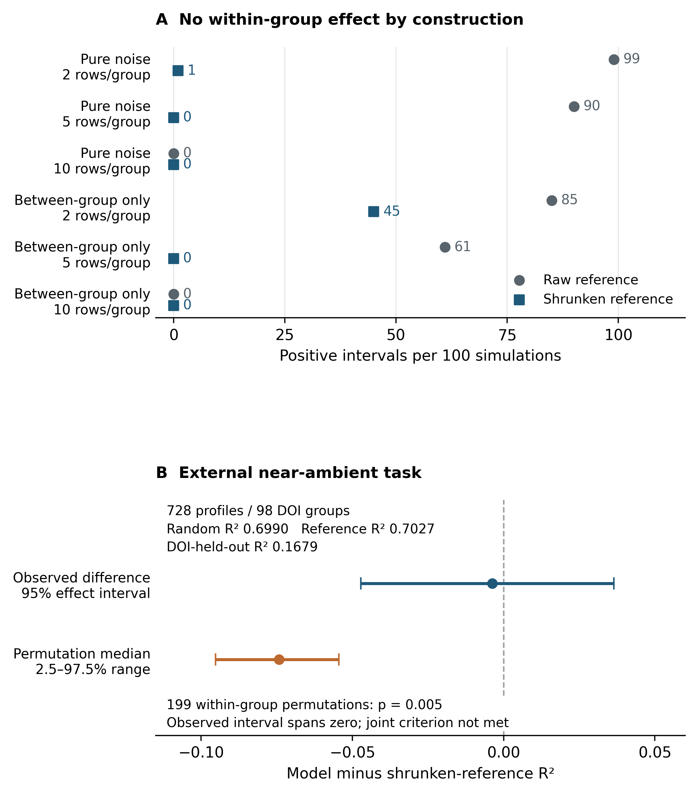

# Supplementary Information for A bounded audit of conductivity records and prediction tasks in starch materials

**Review supplement, 18 September 2026.** This supplement accompanies the applicability-audit review draft. It reorganizes existing frozen evidence and computations and reports no new scientific run or independent human verification.

## S1 Units and the historical frame

A **legacy row** is an old computational sample key, not necessarily one unique experiment. A **fact** is an extracted property statement linked to an old row. An **observation report** is a located statement about a measurement; different statements can describe one event. A **profile** is a recorded formulation and processing identity. A **reporting carrier** is the article in which evidence appears, which can quote measurements from another article. A **source component** connects carriers by confirmed or conservatively retained possible reuse. No component count certifies independent experiments.

The acquisition frame had 501 full-text files and 207 historically retained extraction records. It combined legacy sources and fixed retrievals, so neither count defines a field-wide systematic sample. The current inventory covers 603 conductivity rows and 162 ingestion paths; 684 other rows in the all-record wide table were not included in this conductivity audit. A separately located prior article did not increase the 603-row denominator.

The fixed 20-key sample was drawn from the 100 legacy keys in the 545-row primary view with seed 20260908, without replacement, taking all associated rows. It comprised 118 rows and 130 facts. Its 152 observation reports and 14 separate follow-up items must not be pooled into a larger random sample. Under that original design, each legacy group and row had inclusion probability 0.2 and design weight 5; these weights do not apply to subsequently deduplicated sources or to the corrected core records. The original human packet remains uncompleted; its preparation and mechanical integrity checks supply no human accuracy estimate.

**Table S1. All 17 inventoried historical views.** The four eligibility counts are core-compatible/noncore/outside-scope/unresolved, restricted to the audited conductivity rows. Wider-table row counts include unreviewed nonconductivity rows. These overlapping views are not independent replications. The term verified is a legacy pipeline flag, not human or current material certification.

| Legacy view | All rows | Legacy keys | Audited EC rows | Rows in primary view | Other non-EC rows | EC eligibility C/N/O/U |
| --- | ---: | ---: | ---: | ---: | ---: | --- |
| wide_all207 | 1287 | 201 | 603 | 545 | 684 | 49/57/379/118 |
| wide_verified | 496 | 72 | 323 | 304 | 173 | 48/2/202/71 |
| wide_core_release | 496 | 72 | 323 | 304 | 173 | 48/2/202/71 |
| S_all | 603 | 158 | 603 | 545 | 0 | 49/57/379/118 |
| S_all_ge2 | 545 | 100 | 545 | 545 | 0 | 43/39/364/99 |
| S_all_ge3 | 507 | 81 | 507 | 507 | 0 | 38/35/342/92 |
| S_verified | 323 | 70 | 323 | 304 | 0 | 48/2/202/71 |
| S_verified_ge2 | 304 | 51 | 304 | 304 | 0 | 42/2/194/66 |
| S_verified_ge3 | 282 | 40 | 282 | 282 | 0 | 37/2/181/62 |
| strict | 272 | 67 | 272 | 253 | 0 | 38/2/176/56 |
| strict_ge2 | 251 | 46 | 251 | 251 | 0 | 32/2/166/51 |
| strict_ge3 | 227 | 34 | 227 | 227 | 0 | 29/2/151/45 |
| aqueous_from_verdicts | 447 | 114 | 447 | 408 | 0 | 49/16/278/104 |
| aqueous_from_papers | 455 | 115 | 455 | 416 | 0 | 49/16/286/104 |
| shipped_aqueous_matrix | 343 | 74 | 343 | 324 | 0 | 48/2/217/76 |
| shipped_drop_known_solid_gt60 | 272 | 68 | 272 | 254 | 0 | 48/2/168/54 |
| process_L1_lineage | 272 | 67 | 272 | 253 | 0 | 38/2/176/56 |

Source: `artifacts/modeling/manuscript_revision/local_evidence/scope_view_coverage.csv`. The corrected table connects to 39 legacy rows; 30 corrected records connect to the 545-row primary view and 5 originate outside it. It is not a simple filtered copy of that primary view.

## S2 Material criteria and corrected record dispositions

The frozen criteria are in `docs/spec/criteria_and_schema.md`. Starch matrix status uses approximately 50% of network-forming polymers; approximately 15–50% co-network compositions can be retained as noncore. The denominator excludes solvent, salts and fillers and includes polymerized synthetic monomers. Dry films, solutions and pellets fail the project's gel-state gate. Predominantly electronic, redox/proton and unresolved mixed-conduction systems do not become core ionic aqueous hydrogels simply because conductivity is reported. Other solvent families and co-networks remain separately identified.

The correction protocol in `artifacts/modeling/manuscript_revision/local_evidence/corrected_data_protocol.md` was committed before the derived table, after the evidence problems and earlier results were known. Its status is retrospective correction, not blinded preregistration. It distinguishes nominal composition boundaries, test state, author-reported printed point values, approximate values, graphs, ranges and conflicts. It keeps possible reuse separate from confirmed duplicates, and preparation quantities separate from quantities bound to conductivity measurement.

`Author-reported printed point value` denotes a scalar value explicitly displayed by the authors in a form admissible under the frozen protocol. It is a reporting-form label, not a claim of physical exactness or independent accuracy. Approximate values, graph-derived values, ranges, orders of magnitude and unresolved conflicting reports remain separate evidence classes.

**Table S2. Mutually exclusive dispositions of the 603 old conductivity rows.** Dispositions preserve the old records and describe the new table's relation to them.

| Disposition | Legacy rows |
| --- | ---: |
| Outside the defined scope | 379 |
| Material unresolved and held | 118 |
| Noncore and retained only in the inventory | 57 |
| Retained directly | 28 |
| Material-compatible but no admissible scalar or unique sample | 10 |
| Involved in merging confirmed repeated reports | 10 |
| Split into distinct condition records | 1 |
| Total | 603 |

The last four categories account for the 49 material-compatible rows. The 28 directly retained rows plus five merged reports from ten rows plus two condition records from one row yield 35 records. They represent 34 profiles and 15 conservative source groups. The 1601 ledger entries are dispositions and links, not samples or research contributions. All corrected records carry an AI observer identity, incomplete human-review status and no certification of source independence.

Conductivity conversions used S/m ×0.01, mS/cm ×0.001 and μS/cm ×10⁻⁶. Kelvin was converted by subtracting 273.15. Resistivity was inverted only when the reported quantity and geometry supported that interpretation. Conductance or resistance alone was not relabeled conductivity. The author-reported printed point label indicates reporting form and display precision, not physical exactness or an independent accuracy assessment. Unknown temperature was not filled with 25°C and unknown water was not filled with zero.

The old sample target was a linear-S/cm median followed by log10. New records do not average different temperatures, states, methods or incompatible source values. Exact source/report identifiers, units and all old-to-new links remain in `corrected_rows.csv` and `change_ledger.csv` in the same evidence directory. The corrected features retain raw recipe expressions, units, denominators, preparation-versus-measurement stage and missingness rather than inheriting the old feature matrix.

## S3 Every corrected hydrogel task

Bulk means a material-level conductivity estimate based on impedance resistance and geometry. Complete-device/interface estimates, four-probe or other procedures, and unknown methods remain distinct. The numerical near-ambient task chooses the eligible point nearest 25°C within 20–30°C, breaking an equal-distance tie toward the lower temperature. It does not normalize measurements to 25°C. Text-only room temperature is a separate task.

**Table S3. All recorded corrected-hydrogel tasks and fixed sensitivities.** Group sizes count distinct profiles. Task rows overlap; the numerical bulk task includes the near-ambient task. Empty rows are reported, not silently removed.

| Task | Records | Profiles | Groups | Profiles per group |
| --- | ---: | ---: | ---: | --- |
| Bulk at numerical 20–30°C | 2 | 2 | 2 | 1,1 |
| Bulk at exactly 25°C | 0 | 0 | 0 | None |
| Bulk at text-only room temperature | 11 | 11 | 4 | 1,1,4,5 |
| Bulk at any numerical temperature | 3 | 3 | 3 | 1,1,1 |
| Bulk with unknown temperature | 8 | 8 | 4 | 2,2,2,2 |
| Complete device or interface estimate | 9 | 9 | 2 | 3,6 |
| Other measurement methods | 3 | 3 | 3 | 1,1,1 |
| Unspecified method | 1 | 1 | 1 | 1 |
| 20–30°C and ≥2 profiles per group | 0 | 0 | 0 | None |
| Text-only room temperature and ≥2 profiles per group | 9 | 9 | 2 | 4,5 |
| 20–30°C without nominal composition boundary | 1 | 1 | 1 | 1 |
| 20–30°C without ancillary discrepancy | 1 | 1 | 1 | 1 |

Source: `artifacts/modeling/manuscript_revision/local_evidence/corrected_data_summary.json`, cross-checked against `corrected_rows.csv`.

The six mutually exclusive record-level measurement categories are numerical-temperature bulk (3), text-only room-temperature bulk (11), temperature-unknown bulk (8), complete-device/interface (9), other methods (3), and method-unknown (1), totaling 35 retained records. Profiles and conservative source groups are not additive across those rows. The 20–30°C, exactly-25°C, group-size and two one-record sensitivity views are derived subsets of the same retained evidence.

The two near-ambient rows are L03R-39b70655fb428ae234d2, sample CS:A 3:3 Sw, 0.027 S/cm at 30°C, and L03R-96c452f294df04db07e6, sample SHEM, 0.349 S/cm at 30°C. Their legacy rows are A207:0278 and A207:0820, respectively. The former has both a nominal network-composition boundary and an ancillary comparison-table discrepancy. These flags are retained; they are not newly resolved here. The 35-record table has no certified numerical wet-basis water fraction bound to its conductivity measurements. Other water-related measurements or recipe quantities in the articles are not thereby declared absent.

No listed corrected-hydrogel task contained five source groups. Five-fold source hold-out is therefore undefined under the recorded design. The separate historical small-size flag (`n<100` and `groups<25`) restricts interpretation to descriptive evidence. Neither criterion proves that a material can never be modeled or that five groups would alone be sufficient.

## S4 Every dry-film feasibility task

The gate envelope comprised 234 old rows and 46 reporting carriers. Two potato-starch samples were pellets and the PSK6 sample was a solution; removing these left 231 dry-film rows from 45 carriers and 232 observation reports. Confirmed links gave 220 report components, 212 mapped profiles and 8 unresolved profile mappings. Carrier-level source components numbered 44 with confirmed links and 42 with conservative possible links; neither is a count of certified independent studies.

Of the 231 old rows, 187 had registered observations and 44 did not. After confirmed report deduplication, 38 components had no observations; 30 had mapped profiles and 8 did not. The 232 observation reports comprised 215 author-reported printed point values, 9 author approximate values, 4 graph-derived reports, 2 orders of magnitude and 2 conflicted reports. Three otherwise printed-point reports were additionally held for location or sample-assignment conflicts, yielding five point-held observations in total. Those are observations, not five independent papers.

Numerical temperature was available for 95 reports; 93 supplied only room-temperature text and 44 had other missing or ambiguous temperature. Method families were bulk impedance 209, spectral plateau 7, Jonscher fitted conductivity 6, fractal-model DC conductivity 4, fractal-model sigma0 4 and incompletely specified impedance estimate 2. Counts in this paragraph are mutually exclusive observation-level classifications. The legacy-row precision flags in the source inventory are overlapping and cannot replace these denominators.

**Table S4. All 19 specified dry-film uses.** P/G denotes mapped profiles/conservative source groups. The ≥2 arm retains groups with at least two distinct profiles. The last column removes whole groups with registered unresolved measurement lineage; it does not certify independence. Counts include no new target extraction.

| Use | Reports | P/G | Singleton groups | ≥2 arm P/G | Without registered unresolved lineage P/G |
| --- | ---: | --- | ---: | --- | --- |
| Bulk at numerical 20–30°C, approximate temperature allowed | 35 | 35/11 | 4 | 31/7 | 29/10 |
| Bulk at numerical 20–30°C, approximate temperature excluded | 26 | 26/10 | 4 | 22/6 | 20/9 |
| Bulk at exactly nonapproximate 25°C | 10 | 10/5 | 2 | 8/3 | 8/4 |
| Bulk at text-only room temperature | 85 | 81/10 | 3 | 78/7 | 28/8 |
| Bulk at any numerical temperature | 71 | 49/14 | 3 | 46/11 | 43/13 |
| Bulk with unknown or ambiguous temperature | 33 | 32/4 | 1 | 31/3 | 32/4 |
| Nonapproximate near-ambient bulk plus numerical measurement RH | 0 | 0/0 | 0 | 0/0 | 0/0 |
| Author approximate bulk values | 9 | 7/5 | 3 | 4/2 | 7/5 |
| Graph-derived bulk evidence only | 4 | 4/2 | 0 | 4/2 | 4/2 |
| Jonscher fitted sigma0 | 6 | 6/2 | 1 | 5/1 | 6/2 |
| Low-frequency spectral plateau | 7 | 7/1 | 0 | 7/1 | 7/1 |
| Fractal-model sigmaDC | 4 | 4/1 | 0 | 4/1 | 4/1 |
| Fractal-model sigma0 | 4 | 4/1 | 0 | 4/1 | 4/1 |
| Fixed-frequency AC | 0 | 0/0 | 0 | 0/0 | 0/0 |
| Independent DC or volume resistivity | 0 | 0/0 | 0 | 0/0 | 0/0 |
| Complete device or interface | 0 | 0/0 | 0 | 0/0 | 0/0 |
| Impedance with unspecified estimator | 2 | 1/1 | 1 | 0/0 | 1/1 |
| Printed points with unknown method | 0 | 0/0 | 0 | 0/0 | 0/0 |
| Nonpoint or conflicting evidence | 11 | 9/5 | 1 | 8/4 | 9/5 |

Source: `artifacts/modeling/manuscript_revision/route_feasibility/task_summary.csv` and `task_source_groups.csv`. Numerical near-ambient includes approximately stated temperatures, except in the explicit sensitivity. All printed-point uses continue to require identifiable sample, relevant method and no point hold. The 25°C, near-ambient and all-numerical tasks overlap. Approximate-value, graph and conflict rows are descriptive feasibility categories, not admitted training labels.

The near-ambient group sizes are 1,1,1,1,2,3,3,4,4,6,9. Removing approximate temperatures leaves 1,1,1,1,2,3,3,4,4,6. Exactly 25°C yields 1,1,2,2,4. Text-only room temperature yields 1,1,1,4,5,5,5,6,20,33, so two components contain 53 of the 81 profiles. The 33-profile chain has unresolved reuse and the 20-profile component has possible within-source reuse; unresolved does not mean confirmed duplication of all its profiles.

For the 231 dry-film legacy rows, conditioning was numerical RH during measurement in 11, approximate RH in 9, preconditioning RH only in 8, vacuum during measurement in 12, a sealed inert environment in 1, and no bound environment in 190. These sum to 231. None had a water-content value recorded as bound to measurement; the states were not reported 91, preparation only 85 and ambiguous 55. Vacuum, drying and dry-film form do not imply zero water.

Recipe-denominator status was known in 54 rows, partial in 175, conflicted in 1 and unknown in 1. In the 35-profile near-ambient task it was known in 18 and partial in 17. Complete formulation comparability does not follow from a known denominator. At nonapproximate near-ambient temperature plus numerical measurement RH, the count was zero because no registered point observation met all conditions. Four PG098 legacy rows already had 25°C/35% RH evidence but no registered scalar observation. The zero therefore does not assert that such values are absent from the articles.

## S5 Case evidence and source relations

The following index makes the main examples traceable without redistributing article text or page images. Identifiers are internal locators only. Primary case papers are identified directly by author, year and DOI in this supplement; their identities do not depend on main-text reference numbering. All judgments remain AI-assisted and are awaiting independent human checking.

**Table S5. Decisive case index.** Paths in this table are relative to `artifacts/modeling/manuscript_revision/local_evidence` unless another directory is named.

| Case and identity | Source location and recorded evidence | Bounded interpretation |
| --- | --- | --- |
| CS:A 3:3 Sw, A207:0278, Cruz-Balaz et al. (2023), DOI 10.1007/s10965-023-03566-0 | Table 3 and Table 1 sample codes; `scope_batches/c_02.json`, L03-C10; corrected row L03R-39b70655fb428ae234d2 | 0.027 S/cm at 30°C is sample-specific; Table 4 battery comparison lacks matching sample/temperature; approximately 50% network boundary remains |
| SHEM, A207:0820, Zhen et al. (2025), DOI 10.5796/electrochemistry.24-00125 | Methods and conductivity discussion; `scope_batches/a_05.json`, L03-A28-E03 to E05; corrected row L03R-96c452f294df04db07e6 | 0.349 S/cm at 30°C; SEM drying is not the conductivity state; final uptake not quantified in the retained binding |
| Pellet versus film, Tiwari et al. (2011), DOI 10.1007/s11581-010-0516-0 | Table 1; A207:0178/0181 are pellets, A207:0182/0183 soft thick films; L03-C05-P/V | A gate failure alone does not identify a dry film; morphology is sample-specific |
| Final potato-starch formulation, Tiwari et al. (2011), DOI 10.1007/s11581-010-0516-0 | Abstract/body/table comparisons in `scope_batches/c_01.json` and `route_feasibility/evidence_annotations.json`; L03-C05-0183-O01 | Conflicting location-specific values remain held in the dry-film count; no new author-value correction |
| CS20 temperature reports, Teoh et al. (2014), DOI 10.1016/j.measurement.2013.10.040 | Table 3, original PDF p4; `measurement_batches/PG052.json`, L02-PG052-E01 to E09 | Two temperatures must not silently become one isothermal target through a legacy median |
| Two conductivity estimates, Anandha Jothi et al. (2020), DOI 10.1016/j.physb.2019.411940 | Table 2 sigma-ac and Cole–Cole/bulk-related columns; original PDF p26; `measurement_batches/PG055.json` | Different estimates and their conditions remain separate; a method name alone does not establish equivalent observables |
| Figure converted to a machine table | DOI 10.1016/j.ssi.2019.01.002, Figure 5a, original PDF p4; `measurement_batches/PG087.json`, L02-PG087-E01 to E09 and E99 | A parser-created table is not an author numerical table; five legacy rows affected; original figure/text uncertainty remains |
| Physical feature names | DOI 10.1007/s11581-014-1092-5; PG020; `input_issue_disposition.csv` and `measurement_batches/PG020.json` | Twelve facts describe activation energy or transference number, not gel point/water activity; these names were not in the old 21-input model |
| Same article under two legacy groups | DOI 10.1016/j.electacta.2014.05.075; PG040/PG099; `identity_evidence.json` and `identity_impact.json` | Same carrier was split in the primary legacy folds; sample and measurement deduplication require separate evidence |
| Quoted prior measurement | PG019/PG028, carrier DOI 10.1016/j.measurement.2014.08.009 and cited rice-starch precursor; `identity_evidence.json` and `supplemental_followup.csv` | Confirmed prior-measurement reuse differs from unresolved possible remeasurement; the specific affected rows were absent from strict |

The table lists locations recorded by earlier source work. The frozen source review checked the two core-point source texts and their hashes; this review derivative does not repeat the earlier full PDF-page audit. Corpus Markdown and original PDFs remain in the full private research workspace, not the public review repository.

The complete source map contains 154 carrier identifiers, including 88 DOI-shaped keys. Only 87 distinct nonempty actual DOI values were available for the latest exact comparison; one DOI-shaped key, `epoly.2009.9.1.1628`, remained unresolved. Sixty-six additional candidate-only DOI identifiers were compared separately after excluding known wrong attachments. An internally identified Zhou carrier had no noncontradictory comparable DOI. The evidence-supported and candidate-only sets each had zero exact overlap with the external table's 213 DOI identifiers and its 98 primary DOI groups. Zero identifier overlap is not an independence certificate and does not exclude untraced reuse.

Sources: `scope_sources.csv`, `scope_group_assignments.csv`, `scope_group_edges.json`, `identity_impact.json` and `artifacts/modeling/manuscript_revision/route_feasibility/summary.json`. Source-group relationships and confirmed report-duplicate relationships use different nodes; they must not be substituted for one another.

## S6 Complete retained simulation and diagnostic definitions

The retained simulation follows `docs/decisions/2026-09-07_diagnostic_calibration_protocol.md` and its frozen configuration. In $y_{ij}=a_j+\beta_jx_{ij}+\epsilon_{ij}$, $z_j$, $u_j$, $x_{ij}$ and $\epsilon_{ij}$ are independent standard normal draws, with $a_j=\sqrt{0.7}z_j+\sqrt{0.3}u_j$ except for pure noise. The four mechanisms set intercept and slope to zero for noise, slope to zero for between-only, slope to one for a common within-group relation, and independent equiprobable −1/+1 slopes for heterogeneous within-group relations. Common random numbers paired the base draws across mechanisms.

There were 100 groups per dataset, group sizes 2/5/10, and 100 independent generated datasets per cell. Predictors were $x$, group proxy $z$ and categorical group ID. The learner used 350 ExtraTrees, minimum leaf size 2, square-root feature sampling, training-only median imputation and one-hot category frequency threshold 3. The size sweep changes both reference estimation precision and effective category encoding; at two rows per group all identity categories are pooled. Each retained interval used 499 group-bootstrap draws at fixed out-of-fold predictions.

**Table S6. All 12 simulation cells.** Differences are medians across simulated datasets; positive-interval counts are out of 100 repetitions. Wilson intervals and additional quantiles remain in the frozen source table. These counts are neither real-material error rates nor formal type-I error for $\Delta=0$.

| Mechanism | Rows/group | Raw difference | Shrunken difference | Raw positive intervals | Shrunken positive intervals |
| --- | ---: | ---: | ---: | ---: | ---: |
| Pure noise | 2 | +0.7876 | −0.0167 | 99 | 1 |
| Pure noise | 5 | +0.0973 | −0.2320 | 90 | 0 |
| Pure noise | 10 | −0.0390 | −0.1772 | 0 | 0 |
| Between-group only | 2 | +0.2909 | +0.0996 | 85 | 45 |
| Between-group only | 5 | +0.0347 | −0.0067 | 61 | 0 |
| Between-group only | 10 | −0.0170 | −0.0264 | 0 | 0 |
| Shared within-group slope | 2 | +0.7714 | +0.4035 | 100 | 100 |
| Shared within-group slope | 5 | +0.3950 | +0.3108 | 100 | 100 |
| Shared within-group slope | 10 | +0.3331 | +0.3129 | 100 | 100 |
| Heterogeneous within-group slopes | 2 | +0.4619 | +0.1133 | 92 | 61 |
| Heterogeneous within-group slopes | 5 | +0.1340 | +0.0365 | 99 | 57 |
| Heterogeneous within-group slopes | 10 | +0.1839 | +0.1651 | 100 | 100 |

Source: `artifacts/modeling/diagnostic_calibration/run_v1/simulation_summary.csv`. Every replicate remains in `simulations.csv`. The unchanged Supplementary Figure S1 panel A shows all group sizes from the two mechanisms without a within-group effect, rather than selecting individual favorable repetitions. The shared-slope and heterogeneous-slope cells are retained above for completeness.

For training groups of size $n_j$ and mean $m_j$, the shrunken reference was $\mu+w_j(m_j-\mu)$, where $w_j=n_j\tau^2/(n_j\tau^2+\sigma^2)$ and $\mu$ is the training row-weighted mean. The within variance estimate was $SSW/(N-K)$; $MSB=\sum[n_j(m_j-\mu)^2]/(K-1)$, $n_0=(N-\sum[n_j^2]/N)/(K-1)$, and $\tau^2=\max(0,(MSB-\sigma^2)/n_0)$. Untruncated estimates and insufficient-replication events were retained. An unseen group or unestimable reference used the training global mean. These are classical variance-component constructions, not newly introduced methodology.

For the retained paired diagnostic,

$$
\Delta_{\mathrm{shrunk}} = R^2_{\mathrm{random}} - R^2_{\mathrm{shrunken\ reference}}.
$$

The source reference uses training responses only. Group-bootstrap intervals resample whole groups from fixed out-of-fold predictions and do not include full retraining or partition-selection uncertainty. The one-sided Monte Carlo permutation p-value uses $(1+b)/(B+1)$, where $b$ is the number of permuted statistics at least as large as observed.

The standard risk calculation retained in the earlier report assumes $y=a_j+\epsilon$ with independent noise of variance $\sigma^2$ and $m$ same-group training observations. The error of a new response minus the training mean is $\epsilon_{new}$ minus the mean training error, whose variance is $\sigma^2+\sigma^2/m$. A reference knowing the intercept has risk $\sigma^2$. This is an expected-MSE statement, not a substitution of expected ratios in $R^2$; estimated-parameter shrinkage does not have universal known-parameter optimality.

The simulation and starch calibration were specified after earlier starch results were known. This derivative did not reproduce their fits; it checked the stored summaries and uses their frozen values. The complete 594 prior starch permutation runs and 33 prior sensitivity records remain historical analyses, not additional starch material observations.

## S7 External task and complete retained comparisons

The external source is Bradford et al. (2023), DOI 10.1021/acscentsci.2c01123, using the author-compiled table described in the frozen external-analysis record. The frozen record identifies the author file `data/PolymerElectrolyteData.csv` in the Chem-prop-pred repository and raw SHA-256 `5ad82b4b75b9bb95f8f402fd394686d69c97cd0edaa110ad9c330655268a9fab`. The author's data/model MIT statement was documented in earlier source verification. This does not provide permission to redistribute the starch article corpus.

The 16009-row raw table included 146 rows with missing or invalid DOI syntax. After the specified structure, component, conductivity, temperature and salt-molality filters, the broad eligible set had 9140 rows in 169 DOI groups. Restriction to 20–30°C gave 1201 rows; selecting one representative per DOI/profile gave 753 representatives in 123 groups, and removing 25 singleton groups gave 728 profiles in 98 groups. Selection of a representative did not use conductivity to choose a tie. The authors' own model and validation are distinct from this separately trained categorical-feature diagnostic.

Numerical predictors were `temperature_c`, `log10_polymer_mw`, `salt_molality`, `polymer_dispersity` and three reported copolymer fractions. Categorical predictors were `polymer_smiles`, `salt_smiles` and `polymer_architecture`. Missing counts in the seven numerical fields of the primary view were 0,29,0,488,701,701,718. DOI, Notes, administrative IDs and target-derived fields were excluded from prediction; Notes contributed to profile identity only. Missing values and encoding were learned on training folds, with no chemical canonicalization or new graph model.

**Table S7. All three external observed views.** Intervals use 2000 whole-DOI bootstrap samples of fixed predictions. The views are related analyses of one source table, not independent datasets.

The 728 profiles are DOI-qualified profile identities. The prepared input records 724 distinct profile hashes across these representatives; matching profile hashes across DOI groups do not alone establish identical physical formulations or reused measurements. The counts are therefore not 728 certified independent chemistries.

| View | Rows/DOI groups | Random R² | Raw reference R² | Shrunken reference R² | Difference [95% interval] | DOI-held-out R² |
| --- | --- | ---: | ---: | ---: | --- | ---: |
| Near-ambient profiles | 728/98 | 0.6990 | 0.6979 | 0.7027 | −0.0037 [−0.0472, 0.0364] | 0.1679 |
| Same profiles without temperature input | 728/98 | 0.7033 | 0.6979 | 0.7027 | 0.0005 [−0.0479, 0.0485] | 0.1932 |
| Same sources at all temperatures | 6779/98 | 0.9017 | 0.5508 | 0.5510 | 0.3507 [0.2680, 0.4864] | 0.3671 |

Source: `artifacts/modeling/external_diagnostic_replication/run_v1/summary.json`. Metrics and their differences are rounded independently for display. Differences were computed from unrounded values, so subtracting two displayed four-decimal scores need not reproduce the displayed difference exactly. The primary raw-reference score was 0.6979. Eight primary test rows lacked a same-source training row and used the global-mean fallback; no canonical shrinkage variance estimate was truncated at zero. Random-row and DOI-held-out root mean squared errors were 1.0558 and 1.7555 log10(S/cm), respectively. These are not the published Bradford model's performance.

All 199 within-source permutations had a statistic below the observed difference. Their median was −0.0743 and their 2.5th–97.5th percentile range [−0.0952,−0.0545]; $p=(1+0)/(199+1)=0.005$. The 99 global controls gave median −0.1253, range [−0.1758,−0.0742], and $p=0.010$. The corresponding exact binomial 95% intervals for the sampled exceedance fraction were [0,0.0184] and [0,0.0366]. They concern Monte Carlo tail uncertainty, not a model-reference effect interval. Every permutation refitted the feature model and references, with unchanged unsupervised training-feature transforms cached. Within-source exchangeability is an assumption, not a test of material truth.

Ten fixed partitions gave reference differences from −0.0095 to 0.0203 and DOI-held-out R² from 0.1105 to 0.2354. Three additional estimator seeds gave differences from −0.0030 to −0.0020. Canonical/base seed was 20260908; partition seeds were 20260908+101*k for k=0,...,9, and the three additional model seeds were 20260918,20260928,20260938. These numeric RNG identifiers are not calendar dates. The canonical partition was reused rather than counted as a new execution. Full 13 sensitivity rows are in the frozen summary.

The all-temperature expansion contained 6779 rows in the same 98 groups and 1121 profiles, 393 more profiles than the primary set. The later structural inventory found 5864 temperature rows among the original 728 profiles; it did not fit that new restricted contrast. Therefore the score of 0.9017 is not an isolated effect of adding temperature points. The external study's pre-execution joint positive-evidence criterion was false: the difference interval was not wholly positive despite significant pairing.

**Figure S1. Interpretation limits of source-reference and within-source pairing diagnostics.** Panel A retains the previously completed simulation and shows that, under the specified between-group-only mechanism, a positive model-minus-shrunken-reference interval can occur without a within-group feature effect. Panel B retains the external 728-profile/98-DOI-group diagnostic: $\Delta_{\mathrm{shrunk}}=-0.0037$ [95% interval −0.0472, 0.0364], while the within-source permutation result is $p=0.005$. These panels address statistical interpretation only; they do not add starch observations, validate starch material classifications, or estimate a field-wide error rate. The underlying figure file is unchanged from the frozen Figure 3.

## S8 Historical analyses and protocol limitations

**Table S8. Frozen historical starch scores retained for provenance only.** These use legacy inputs and groups, with 2000-draw fixed-prediction bootstrap intervals. They are not corrected hydrogel performance.

| Legacy view | Rows/legacy groups | Random R² | Raw reference R² | Shrunken reference R² | Difference [95% interval] |
| --- | --- | ---: | ---: | ---: | --- |
| S_all_ge2 | 545/100 | 0.7415 | 0.5922 | 0.6130 | 0.1284 [0.0661, 0.1898] |
| S_all_ge3 | 507/81 | 0.7568 | 0.6258 | 0.6230 | 0.1338 [0.0763, 0.1993] |
| strict_ge2 | 251/46 | 0.6816 | 0.4924 | 0.5110 | 0.1705 [0.1096, 0.2500] |

Source: `artifacts/modeling/diagnostic_calibration/run_v1/observed.csv`. The 545-row view had legacy-group-held-out R²=0.4443 and 199 within-group permutations giving $p=0.005$. This result does not certify true-source separation after the later identity findings. The legacy strict labels do not certify a purely aqueous-hydrogel, graph-free or human-verified population.

The older fixed-row pipeline comparison used 272 strict rows/67 legacy groups and gave grouped R² of 0.1285, 0.2890, 0.3299 and 0.4420 along its stated four-step path. The final score used 21 mixed formulation, process and unit-convention fields, not formulation alone. The approximately 51% learner/encoder share was descriptive and order-dependent. Its within-group process increment was −0.0006 [−0.1024,0.1357], not evidence of equivalence to zero or absence of process effects. The first step used a whole-table top-eight salt dictionary as a historical reproduction exception; subsequent encodings were trained within folds. None of these fits was rerun for this derivative, and no correction-induced performance change is claimed.

The historical 21-input view contained ten numeric fields (`starch_amount`, `starch_g`, `solid_content_pct`, `water_g`, `water_to_starch`, `salt_content_num`, `plasticizer_content`, `crosslinker_content`, `gelatinization_temp`, `gelatinization_time`) and eleven categorical fields (`salt_canon`, `salt_unit`, `salt_loading_route`, `plasticizer_type`, `crosslinker_type`, `secondary_polymer_type`, `filler_type`, `crosslink_method`, `drying`, `retrogradation`, `freeze_thaw_cycles`). Gel point and water activity were not in that list. Correcting misnamed facts cannot by itself be claimed to change that model's process result.

The initial global-permutation stopping action was not followed after a threshold fired; a byte-identity test failed at about 1.78×10⁻¹⁵; the process protocol was replaced after a coding defect and inspection of descriptive ICC; and an earlier informed-floor study continued after its stopping rule. The historical ledger remains in `paper_methods_validation/supplementary_information.md` and is not relabeled as passed. Newer protocols preceded their own derived tables or fits but were informed by earlier results. They do not retrospectively restore blind confirmation.

Older mechanical, temporal, CALiSol and mediator-reporting studies are not needed to establish this manuscript's main argument and are not presented as new confirmations. The old nominal-core support percentages and quote-presence counts are likewise not promoted to human accuracy or used to justify the corrected evidence population.

## S9 Unresolved work and evidence identity

No independent human audit has been completed. The original packet contains 4470 blank human fields in its frozen initial outputs; that is an integrity fact, not a measure of work completed. Its 118 rows and the corrected core have zero row and carrier overlap.

A previously proposed targeted human check has not been executed and is not activated by this review text. Its existence is recorded only to distinguish planned work from completed evidence. No human-return dataset is claimed here.

Such checking, if separately authorized in the future, could revise the current record counts but would not manufacture missing temperature, water content or independent sources. It also would not certify all 118 unresolved material rows or all exclusions as free of missed evidence. Prior exposure to AI findings would need to be declared rather than assumed absent.

Reference verification for the frozen review version is recorded in `artifacts/modeling/manuscript_revision/advisor_review_v1/reference_check.json`. Claim support levels differ. Metadata alone does not validate case values. No comprehensive novelty search was conducted for this framing, and this review derivative does not add one.

Author order, affiliations, corresponding-author information, CRediT roles, funding and grant identifiers, conflicts of interest and acknowledgements were not supplied in the materials reviewed for this draft. They remain unset and must not be inferred or fabricated.

## Supplementary references

S1. Searle, S. R.; Casella, G.; McCulloch, C. E. *Variance Components*. Wiley (1992). DOI: 10.1002/9780470316856.

S2. Phipson, B.; Smyth, G. K. Permutation P-values Should Never Be Zero: Calculating Exact P-values When Permutations Are Randomly Drawn. *Statistical Applications in Genetics and Molecular Biology* 9(1), Article 39 (2010). DOI: 10.2202/1544-6115.1585.

S3. Morris, T. P.; White, I. R.; Crowther, M. J. Using simulation studies to evaluate statistical methods. *Statistics in Medicine* 38(11), 2074–2102 (2019). DOI: 10.1002/sim.8086.

S4. Bradford, G. et al. Chemistry-Informed Machine Learning for Polymer Electrolyte Discovery. *ACS Central Science* 9(2), 206–216 (2023). DOI: 10.1021/acscentsci.2c01123.

S5. Cruz-Balaz, M. I. et al. Synthesis and characterization of Chitosan-Avocado seed starch hydrogels as electrolytes for zinc-air batteries. *Journal of Polymer Research* 30(6), 189 (2023). DOI: 10.1007/s10965-023-03566-0.

S6. Zhen, C.; Dedetemo, P. K.; Chiku, M.; Higuchi, E.; Inoue, H. Preparation and Characterization of Starch-Based Hydrogel Electrolyte Membrane for Quasi-Solid-State Rechargeable Alkaline Zinc Battery. *Electrochemistry* 93(2), 027010 (2025). DOI: 10.5796/electrochemistry.24-00125.

S7. Tiwari, T.; Srivastava, N.; Srivastava, P. C. Electrical transport study of potato starch-based electrolyte system. *Ionics* 17(4), 353–360 (2011). DOI: 10.1007/s11581-010-0516-0.

S8. Teoh, K. H.; Lim, C.-S.; Ramesh, S. Lithium ion conduction in corn starch based solid polymer electrolytes. *Measurement* 48, 87–95 (2014). DOI: 10.1016/j.measurement.2013.10.040.

S9. Anandha Jothi, M. et al. Investigations of lithium ion conducting polymer blend electrolytes using biodegradable cornstarch and PVP. *Physica B: Condensed Matter* 580, 411940 (2020). DOI: 10.1016/j.physb.2019.411940.

## Public distribution note

This is a reduced public derivative of the 14 September 2026 review supplement, updated for the review delivery of 18 September 2026. Scientific tables and numerical results are retained without a new scientific run. Article full text, original paper PDFs/page images, complete private fact tables and source-reconstruction material, private cleaning/source mappings, local-path metadata, historical model binaries and unchecked administrative/contact material are not redistributed. Use the public reproducibility note for the available public inputs and checks; missing original dependencies do not count as a passed full reproduction.
